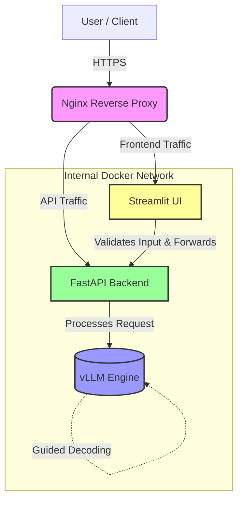

<h1 align="center">Qwen-HR-Finetuning-vLLM: Enterprise AI Job Description Parser</h1>

<p align="center">
  
  
  
  
  
  
</p>

## 🚀 Overview
**Qwen-HR-Finetuning-vLLM** is an enterprise-grade AI pipeline engineered to parse unstructured English job descriptions into structured, bilingual (English/Arabic) JSON data. Built from scratch to solve real-world recruitment bottlenecks, this scalable microservice architecture leverages state-of-the-art Supervised Fine-Tuning (SFT) and ultra-high-throughput vLLM inference deployed seamlessly via Docker.

---

## ☁️ Live Demo Access

Want to see this **Enterprise AI HR Parser** in action without setting up the full Docker and GPU infrastructure locally?

I maintain a fully configured **GitHub Codespace** environment for this project. Since this is a resource-intensive microservices architecture running vLLM, the live environment is spun up on demand.

> **Interested in a test drive or discussing the architecture?**
> Please **[Contact Me via LinkedIn](https://www.linkedin.com/in/abdo-ghazala/)**, and I will provision a temporary public URL for you to explore the UI, Swagger API, and AI pipeline interactively.

---

## 🧠 The Vision & ML Backstory

Parsing complex, domain-specific job descriptions into reliable, strictly formatted JSON requires deep contextual understanding. Here is how I brought this vision to life from data synthesis to inference:

### **1. Data Engineering & Synthesis Alliance:**
To overcome the lack of high-quality multilingual HR datasets, I engineered a bespoke dataset of **385 highly diverse HR records**. This was powered by a synthesis alliance using the industry's heaviest hitters: Gemini Pro 3, ChatGPT 5.2, and Claude Sonnet 4.6. 
* **Data Splitting**: Carefully partitioned into 90% Training and 10% Validation to strictly prevent overfitting.
* **Parsing Rules**: Enforced robust anti-missing algorithms, ensuring contextual Arabic translation of metadata while stringently preserving Technical Stacks in English, completely governed by strict Pydantic schemas.

### **2. Precision Model Fine-Tuning (SFT & LoRA):**
* **Base Model**: `Qwen/Qwen2.5-1.5B-Instruct` was strategically chosen for its unparalleled capability to digest complex multilingual tasks while retaining a remarkably efficient parameter footprint.
* **Framework & Technique**: Utilized **LLaMA Factory** for Supervised Fine-Tuning (SFT) utilizing Low-Rank Adaptation (LoRA) configured at `Rank=32`.
* **The Edge**: The fine-tuned construct vastly outperformed a standard from-scratch Transformer baseline in both cross-lingual entity understanding and accuracy, demonstrating the profound leap enabled by Transfer Learning and targeted SFT.
* **Weights Checkpoint**: Openly hosted on Hugging Face at `abdoghazala7/Jobs`.

---

## 🏗️ Architecture Flow



---

## ⚡ Engineering Achievements (The vLLM Edge)

Migrating from baseline PyTorch/Transformers to the high-performance **vLLM** inference engine unlocked massive scalability and efficiency metrics:

* **Dynamic Adapter Serving**: Enabled `--enable-lora` to serve LoRA weights entirely on-the-fly without the need for static weight merging, saving massive storage and ensuring dynamic adaptability.
* **Memory Management Masterclass**: Engineered utilizing **PagedAttention** (operating like OS virtual memory for GPU VRAM), strictly capping KV Cache memory utilization at a stable 85%.
* **16x Throughput Explosion**: Scaled generation throughput from a native 48 tokens/sec to an astounding **772 tokens/sec** on a single T4 GPU.
* **95% Latency Reduction**: Slashed average request latency from 19.8 seconds down to **0.90 seconds** under heavy concurrent load (rigorously load-tested with Locust simulating 20 concurrent HR users).
* **Zero-Latency Guided Decoding**: Integrated **Outlines/Pydantic** directly at the inference engine level, guaranteeing 100% reliable structured JSON output mapping with absolutely zero imposed latency penalties.

---

## 🛡️ Frontend, Validation & Security

* **Strict Pydantic UI Alignment**: The frontend is not just a visual layer; it acts as an intelligent gateway that validates all user inputs directly against strict Pydantic models before engaging the LLM.
* **Nginx Edge Security**: Deployed behind a production-grade Nginx reverse proxy armed with robust security headers, managing ingress traffic gracefully.
* **Fortified Internal Routing**: Utilizing Docker's internal networking, direct exposure to the FastAPI backend and vLLM servers is restricted, ensuring attack surfaces are comprehensively limited and completely internal to the Docker network.

---

## 🚀 Getting Started / Local Setup

If you wish to deploy the full stack locally (Requires Nvidia Docker Support & compatible GPU):

1. **Clone the Repository**
   ```bash
   git clone [https://github.com/abdoghazala7/Qwen-HR-Finetuning-vLLM.git](https://github.com/abdoghazala7/Qwen-HR-Finetuning-vLLM.git)
   cd Qwen-HR-Finetuning-vLLM

2. **Boot the Microservices Architecture**
   Ensure Docker and Docker Compose are installed. Simply run:
   ```bash
   *Note: Ensure you have configured your `.env` files and have the Nvidia Container Toolkit installed for vLLM GPU acceleration.*
   docker-compose up -d
   ```
   *This command will pull necessary images, build the Nginx, Streamlit, FastAPI, and vLLM containers, and wire the internal container networks.*

3. **Access the Stack**:
   - **Streamlit Frontend (User UI):** `http://localhost/`
   - **FastAPI Swagger (Developer Docs):** `http://localhost/api/docs`

---
*Built with ❤️ by **Abdo Ghazala** | AI Engineer & ML Systems Builder.*
