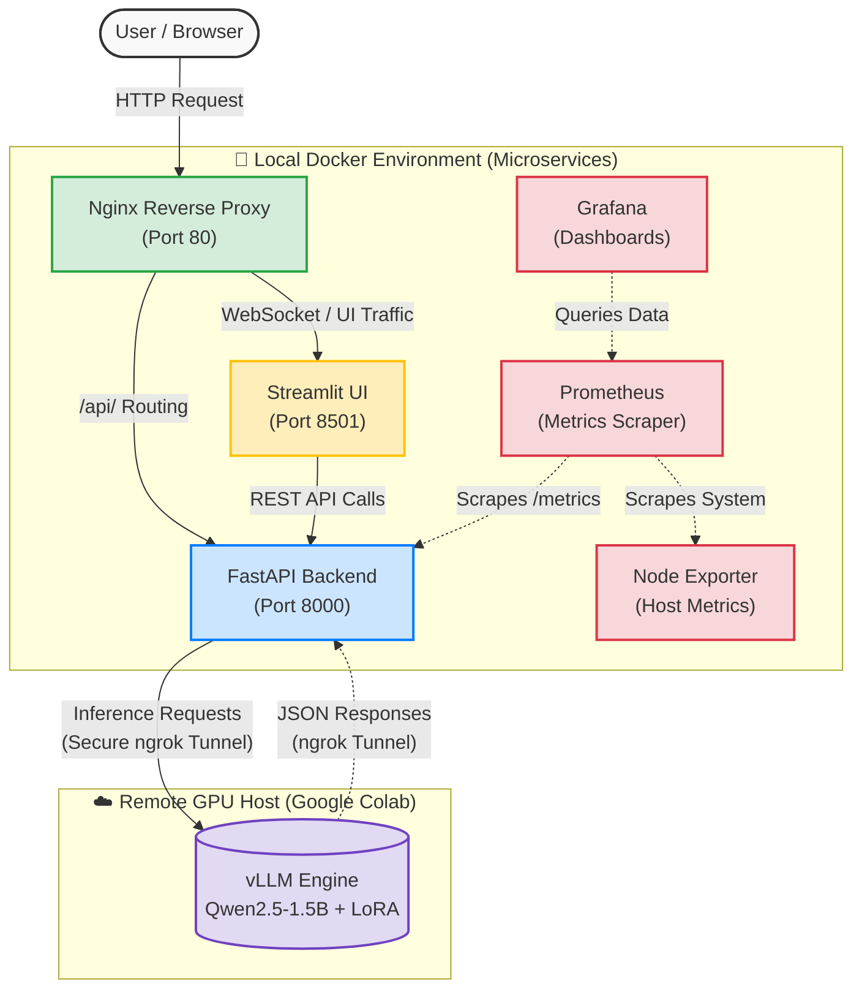

# 🚀 Qwen-HR-Finetuning-vLLM: Enterprise HR Parsing & MLOps Pipeline

[](https://www.python.org/)
[](https://www.docker.com/)
[](https://fastapi.tiangolo.com/)
[](https://streamlit.io/)
[](https://vllm.ai/)
[](https://github.com/QwenLM/Qwen2.5)
[](https://prometheus.io/)
[](https://grafana.com/)

A production-ready, end-to-end Machine Learning Operations (MLOps) pipeline for structured, bilingual (English/Arabic) Job Description parsing. This project solves a real-world enterprise challenge: converting unstructured text into highly accurate JSON schemas using Supervised Fine-Tuning (SFT) and high-throughput vLLM serving.

---

## ☁️ Live Demo Access

Want to see this **Enterprise AI HR Parser** in action without setting up the full Docker and GPU infrastructure locally?

I maintain a fully configured **GitHub Codespace** environment for this project. Since this is a resource-intensive microservices architecture running vLLM, the live environment is spun up on demand.

> **Interested in a test drive or discussing the architecture?**
> Please **[Contact Me via LinkedIn](https://www.linkedin.com/in/abdo-ghazala/)**, and I will provision a temporary public URL for you to explore the UI, Swagger API, Grafana Dashboards, and AI pipeline interactively.

---

## 🧠 The Vision & ML Backstory

At the core of this project is a specialized AI model trained to bridge the gap between complex unstructured English HR descriptions and structured, multilingual data requirements. 

### 1. Data Engineering & Synthesis Alliance
High-quality outputs require high-quality data. I engineered a highly diverse, custom dataset of **385 complex HR records** by utilizing an alliance of state-of-the-art foundation models (Gemini Pro 3, ChatGPT 5, and Claude Sonnet 4.6). 
*   **Data Split:** Enforced a strict 90% Training / 10% Validation split to continuously benchmark and prevent overfitting.
*   **Custom Prompt Engineering Rules:** Programmed strict scraping/parsing rules within the training data, applying anti-missing anomaly algorithms. I ensured a contextual Arabic translation for soft metadata while **strictly maintaining English terminology for all Technical Stacks**.

### 2. Model Fine-Tuning: SFT & LoRA
*   **The Foundation:** `Qwen/Qwen2.5-1.5B-Instruct` was strategically selected due to its astonishing multilingual capabilities and efficient parameter size. 
*   **Training Framework:** Leveraged **LLaMA Factory** for streamlined experimentation.
*   **Optimization Details:** Conducted Supervised Fine-Tuning (SFT) via Low-Rank Adaptation (LoRA) using `Rank=32` to capture nuanced linguistic alignment without catastrophic forgetting.
*   **The Results:** This fine-tuned LoRA artifact vastly outperformed from-scratch Transformer baselines in deep cross-lingual understanding and structural entity extraction.
*   **Artifacts:** The resulting weights are hosted and publicly available on Hugging Face at `abdoghazala7/Jobs`.

---

## 🏗️ Microservices Architecture & Internal Networking

This repository implements a loosely coupled, highly observable microservices architecture isolated within custom Docker networks (`edge` and `backend`), enforcing strict security boundaries. 



### 🧩 Service Breakdown (`docker-compose.yml` Analysis)
*   **`nginx`**: The edge reverse proxy. Enforces strict HTTP security headers (XSS block, Frame-Options DENY, strict Content-Security-Policy), drops payload bodies >2m, and routes `/api` directly to the backend while serving the UI on the root.
*   **`streamlit`**: The user-facing presentation layer. Confined to the `edge` and `backend` network, relying on a health check of the backend before booting.
*   **`fastapi`**: The asynchronous core controller. Acts as the intermediate processing block running on Uvicorn. Completely isolated from the internet (only accessible via Nginx reverse proxy), handling schema enforcement and parsing payloads.
*   **`prometheus`**: Acts as the central metrics brain. Utilizing volume mounts for persistent TSDB storage, it polls FastAPI endpoints and Node Exporter.
*   **`grafana`**: Connected directly to Prometheus for visualization. Persists dashboard configurations via `grafana_data` volume.
*   **`node-exporter`**: Tracks deep host-level CPU/RAM metrics to monitor hardware health during VRAM-intensive inference tasks.

---

### ☁️ Infrastructure & Cost Optimization (Colab + ngrok)
Due to the high VRAM requirements of vLLM and to maintain a zero-cost infrastructure for Phase 1:
- **Compute Host:** Leveraged **Google Colab's T4 GPUs** as a remote inference provider.
- **Network Tunneling:** Utilized **ngrok** to create a secure, low-latency tunnel, exposing the internal vLLM OpenAI-compatible API to our Dockerized FastAPI backend.
- **Impact:** This setup demonstrates a "Hacker's Mindset"—achieving high-performance inference and seamless microservice communication without the need for expensive dedicated cloud GPU instances.

---

## ⚡ Engineering Achievements: The vLLM Edge

Migrating from a standard PyTorch/Transformers pipeline to **vLLM** yielded massive production improvements, shifting the project from a prototype to an enterprise-grade engine.

*   **Dynamic Adapter Serving:** Enabled `--enable-lora` to serve LoRA configurations concurrently on-the-fly without the overhead of permanently merging base Model weights.
*   **Advanced Memory Management:** Harnessed **PagedAttention**, drastically reducing GPU memory fragmentation. Artificially capped VRAM utilization at 85% to ensure container stability during large batch bursts.
*   **Exponential Throughput (16x):** Smashed inference bottlenecks, scaling output from 48 tokens/sec to an astonishing **772 tokens/sec** on a single T4 GPU.
*   **Latency Collapse:** Subjected the system to concurrent load testing (Locust). Through optimization, average request latency plummeted by 95% (from 19.8s down to **0.90s**).
*   **Guided Decoding (100% JSON Reliability):** Rather than hoping the LLM returns valid JSON, we integrated **Outlines / Pydantic** engine-level decoding. The tokenizer is mathematically constrained to only generate tokens valid against our strict HR JSON schema.

---

## 📊 Full Observability & MLOps Pipeline

What separates a script from a subsystem is observability. The entire stack features native instrumentation:

1.  **Metric Exposure:** The `fastapi` service utilizes custom middleware (`src/utils/metrics.py`) to expose latency, request rates, error codes, and token bandwidth endpoints.
2.  **Telemetry Aggregation:** `Prometheus` continuously scrapes these `/metrics` at set intervals alongside `node-exporter` host data.
3.  **Visual Intelligence:** A custom `Grafana` dashboard translates time-series Prometheus data into actionable intelligence. At a glance, infrastructure operators can visualize API health, concurrent request latency, and LLM scaling throughput, guaranteeing 24/7 reliability.

---

## 🛡️ Frontend, Validation & Security

Security and validation happen consistently across all vector points:
*   **Edge Security:** The `nginx` config (`docker/nginx/default.conf`) hides server tokens and enforces a rigid `Content-Security-Policy`, nullifying XSS and framing attempts before they hit the Python stack.
*   **Type Safety:** The entire data modeling pipeline is constructed over strictly typed **Pydantic Schemas** (`src/models/schemas`). 
*   **Internal Routing Security:** Components communicate exclusively over internal Docker bridge networks (`backend` & `edge`). The AI engine and APIs are completely blind to the outside world, accessed only through Nginx port mapping constraints.

---

## 📂 Repository Structure

```text
Qwen-HR-Finetuning-vLLM/
├── docker/                     # Infrastructure configuration and orchestration
│   ├── app/                    # FastAPI backend Dockerfile
│   ├── env/                    # Environment variables (.env.app, .env.grafana)
│   ├── nginx/                  # Edge Reverse Proxy rules & security headers
│   ├── prometheus/             # Prometheus scraping configurations
│   ├── streamlit/              # Frontend Streamlit Dockerfile
│   └── docker-compose.yml      # Master microservices topology map
├── notebooks/                  # AI R&D, experimentation, and LLaMA Factory scripts
│   ├── LLM_Fine_Tuning.ipynb   # Supervised Fine Tuning experiment logs
│   └── vllm_colab_runner.ipynb # Remote Inference Bridge: Deploys vLLM on Google Colab with ngrok tunneling for cost-effective cloud hosting.
├── src/                        # Core Application Source Code
│   ├── controller/             # Business logic: Output cleaning and parsing services
│   ├── core/                   # Application configs & strict environment parsers
│   ├── frontend/               # Streamlit UI, Input forms, and component visualization
│   ├── models/                 # Deep Pydantic schemas enforcing output data structures
│   ├── routes/                 # FastAPI routers mapped to specific endpoints
│   ├── utils/                  # MLOps instrumentation, middleware, and metrics
│   ├── main.py                 # FastAPI Application entrypoint
│   └── requirements.txt        # Backend dependencies 
└── README.md                   # Documentation
```

---

# 🚀 Getting Started / Local Setup

This architecture is strategically designed to be cost-effective. You do **NOT** need a local GPU. The microservices run locally via Docker, while the heavy vLLM inference engine runs remotely on Google Colab, securely bridged via an ngrok tunnel.

---

## Step 1: Clone the Repository

First, pull the project to your local machine to access the configuration files and notebooks:

```bash
git clone https://github.com/abdoghazala7/Qwen-HR-Finetuning-vLLM.git
cd Qwen-HR-Finetuning-vLLM
```

---

## Step 2: Provision the Remote AI Engine (Google Colab)

Before starting the local Docker containers, you must spin up the remote inference server.

- Open the `notebooks/vllm_colab_runner.ipynb` file in Google Colab.
- Create a free account on ngrok and obtain your Auth Token.
- Inside the notebook, locate the ngrok configuration cell and replace the placeholder with your token:

```bash
!ngrok config add-authtoken YOUR_TOKEN_HERE
```

- Run all cells. Once the vLLM server boots successfully, ngrok will output a public **Forwarding URL**  
  (e.g., `https://<hash>.ngrok-free.app`). Copy this URL.

---

## Step 3: Initialize Environment Variables (.env)

You must create your secure environment files before booting the system.

- Navigate to the environment configuration directory:

```bash
docker/env/
```

- Here, you will find template files named `.env.example`. You must create your actual `.env` files based on these templates  
  (e.g., copy `.env.app.example` and rename it to `.env.app`).

- Open your newly created `.env.app` file and paste the ngrok URL you copied from Colab.  
  This ensures the FastAPI backend knows exactly where to route inference requests:

```env
VLLM_API_BASE_URL=https://<your-hash>.ngrok-free.app/v1
```

 **Access the Application Services:**
   *   **Web UI (Streamlit):** `http://localhost/` (Routed through Nginx)
   *   **FastAPI Swagger Docs:** `http://localhost/api/docs`
   *   **Grafana Dashboards:** `http://localhost:3000`
   *   **Prometheus Metrics:** `http://localhost:9090`

---
*Built with by **Abdo Ghazala** | AI Engineer & ML Systems Builder.*
